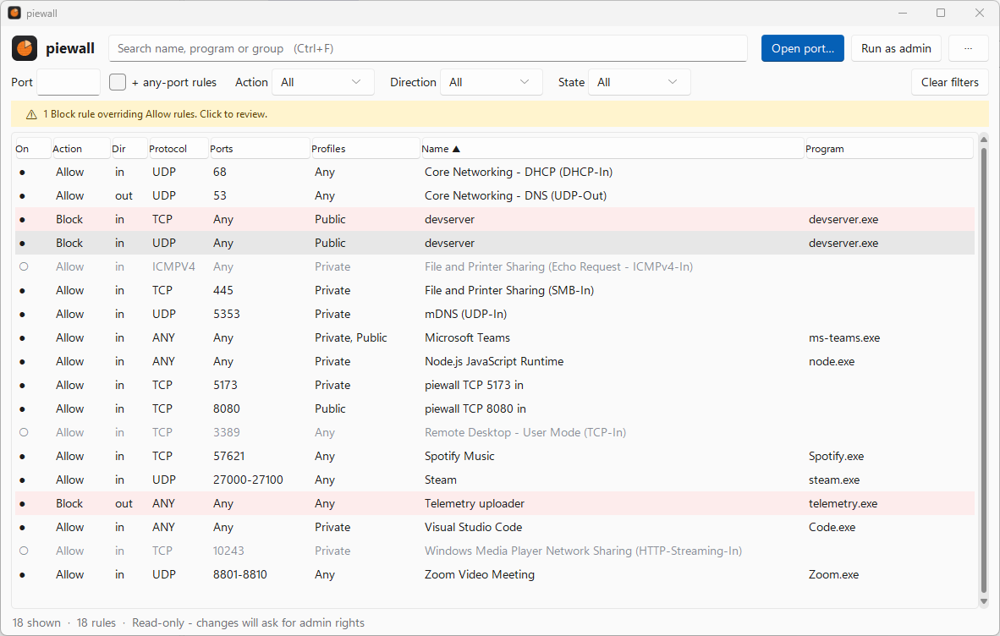

<p align="center">
  
</p>

<h1 align="center">piewall</h1>

<p align="center"><strong>Your firewall, simple as pie.</strong><br>
Manage Windows Defender Firewall rules from a clean window or the command line.</p>

<p align="center">
  <a href="https://piewall.th33raphat.dev">Website</a> ·
  <a href="https://github.com/TheeraphatStudent/piewall/releases/latest">Download</a> ·
  <a href="https://piewall.th33raphat.dev/#coffee">Buy me a coffee</a>
</p>

<picture>
  <source media="(prefers-color-scheme: dark)" srcset="docs/images/app-dark.png">
  
</picture>

## Why

Windows silently creates **Block** rules when you dismiss a firewall popup, and
Block always beats Allow. Your "open port 8080" rule is correct, yet the port is
still closed. piewall shows every rule at a glance, points out the Block rule
that is overriding your Allow rule, and fixes it in one click.

- **Everything at once.** ~850 rules load in half a second, with real app names
  instead of `@{Package?ms-resource://…}` codes.
- **Open or close a port in one step.** Rules piewall creates are grouped, so
  `close` never touches Windows' own rules.
- **Conflict finder.** Flags Block rules that shadow Allow rules, including a
  per-program block for an app that is listening on the allowed port right now.
- **Safe by default.** Read-only until you change something; administrator
  rights are requested through UAC only then.
- **Export / import** rules as JSON, and a **CLI** for scripts.
- Windows 11 look that follows your light/dark setting.

## Install

Download from [Releases](https://github.com/TheeraphatStudent/piewall/releases/latest):

| File | What it is |
|---|---|
| `piewall-setup.exe` | Installer: Start-menu entry, optional `piewall-cli` on PATH, uninstaller. No admin needed. |
| `piewall.exe` | Portable window app, nothing to install. |
| `piewall-cli.exe` | Portable command line tool. |

Builds are not code-signed yet, so Windows SmartScreen may show
"Windows protected your PC" the first time: choose **More info → Run anyway**.
Checksums are in `SHA256SUMS.txt`.

## Use the window

Search, filter by port / action / direction / state, click a column to sort.
Right-click rules to enable, disable, flip Allow/Block or delete; double-click
for details. When a Block rule overrides an Allow rule, a yellow banner appears;
click it to review and fix. **⋯** holds refresh, export and import.

## Use the command line

```powershell
piewall-cli list --search mp4                 # find rules
piewall-cli list --port 8080                  # rules that name port 8080
piewall-cli list --port 8080 --any-port       # ...plus rules open to every port
piewall-cli open 8080 --profile public        # allow inbound TCP 8080 on public networks
piewall-cli open 5353 --udp
piewall-cli close 8080                        # remove the rules piewall opened for 8080
piewall-cli conflicts                         # Block rules overriding Allow rules
piewall-cli allow "mp4toinc-ui"               # flip a rule (all rules with that name)
piewall-cli disable|enable|delete "<name>"
piewall-cli export rules.json [--piewall-only]
piewall-cli import rules.json                 # skips rules that already exist
```

Commands that change rules ask for administrator rights through UAC and print
the result in the same terminal. Exit codes: `0` ok, `1` error / nothing matched
/ conflicts found, `2` usage, `3` UAC prompt cancelled.

## Develop

Needs [uv](https://docs.astral.sh/uv/) and Windows 10/11.

```powershell
uv sync
uv run piewall-gui               # window from source
uv run piewall list              # CLI from source
uv run pytest                    # tests
powershell -File packaging\build.ps1   # build exes + installer into dist\release
```

- Releases: bump `version` in `pyproject.toml`, tag `vX.Y.Z`, push the tag;
  GitHub Actions builds and publishes. See `packaging/README.md`.
- Screenshots: `uv run --with pillow python scripts/screenshot.py docs/images/app-light.png --mode light`
  (demo data, never your real rules).
- Brand kit: `brand/`. Design notes: `docs/superpowers/specs/`.
- Website: `site/` (Astro, deployed to Cloudflare).

macOS support is planned.

## License

MIT © 2026 Theeraphat
